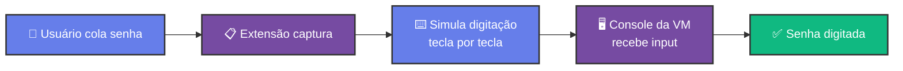
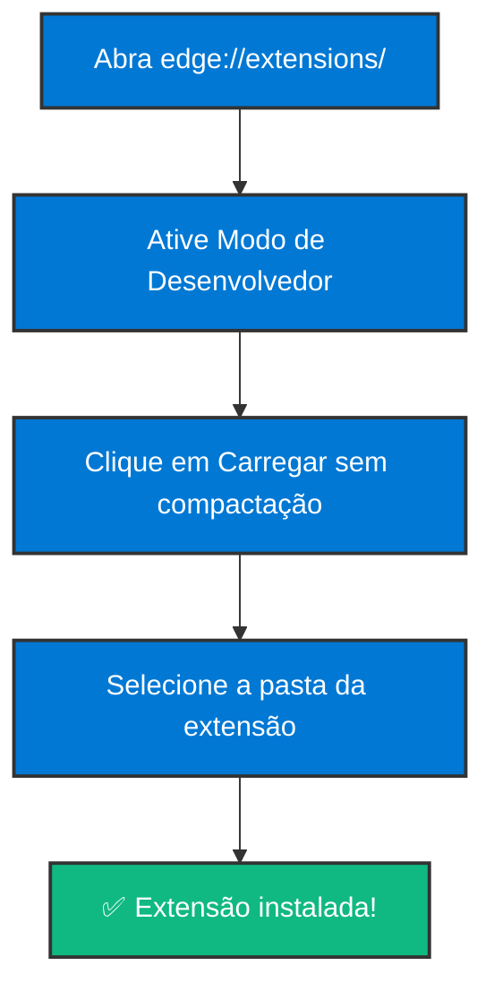
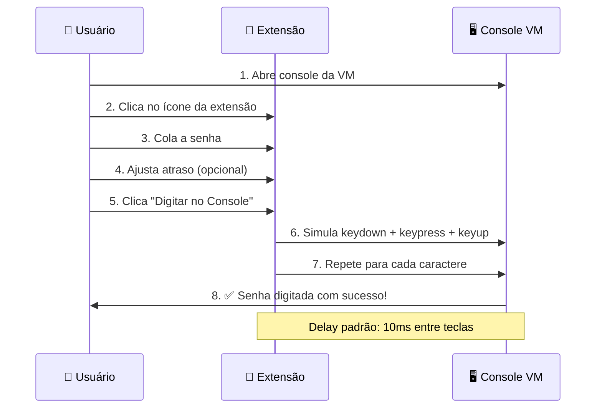
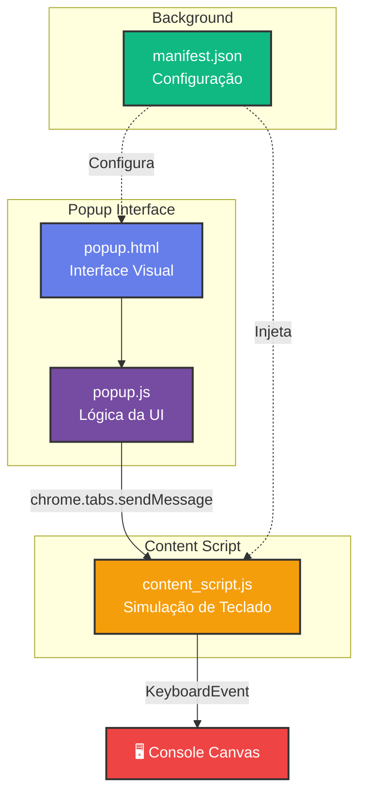

# 🔐 VMware Paste Helper

<div align="center">


**Extensão para navegador que simula digitação em consoles web de VMs**

[Instalação](#-instalação) • [Como Usar](#-como-usar) • [Funcionalidades](#-funcionalidades) • [Solução de Problemas](#-solução-de-problemas)

</div>

---

## 🎯 Sobre

Esta extensão resolve o problema de **não conseguir colar senhas e textos** em consoles web de máquinas virtuais (VMware vSphere, Proxmox, NoVNC, etc.) que não suportam área de transferência nativa.

### 💡 Como Funciona



### ✨ Funcionalidades

- 🔒 **Campo de senha seguro** com alternância de visibilidade
- ⚡ **Controle de velocidade** - ajuste o atraso entre teclas
- 🎯 **Detecção automática** do elemento canvas do console
- ⌨️ **Suporte completo** a caracteres especiais e modificadores (Shift)
- 🎨 **Interface moderna** com gradientes e animações suaves
- 📦 **Leve e rápido** - menos de 50KB total

---

## 📥 Instalação

### Microsoft Edge



1. **Abra o Microsoft Edge**
2. Digite `edge://extensions/` na barra de endereços
3. Ative o **"Modo de desenvolvedor"** (canto inferior esquerdo)
4. Clique em **"Carregar sem compactação"**
5. Navegue até `/home/{sua-pasta}/copy-paste-vm` e selecione a pasta

### Google Chrome

1. **Abra o Google Chrome**
2. Digite `chrome://extensions/` na barra de endereços
3. Ative o **"Modo do desenvolvedor"** (canto superior direito)
4. Clique em **"Carregar sem compactação"**
5. Navegue até a pasta da extensão e selecione

### Firefox (Temporário)

1. **Abra o Firefox**
2. Digite `about:debugging` na barra de endereços
3. Clique em **"Este Firefox"** no menu lateral
4. Clique em **"Carregar extensão temporária..."**
5. Selecione o arquivo `manifest.json`

---

## 🚀 Como Usar

### Fluxo de Uso



### Passo a Passo

1. **Acesse o console web** da sua VM (VMware, Proxmox, etc.)
2. **Clique no ícone** da extensão na barra de ferramentas
3. **Cole sua senha** no campo (ela ficará oculta por padrão)
4. **Ajuste o atraso** se necessário:
   - `10ms` - Conexões rápidas (padrão)
   - `50-100ms` - Se caracteres estiverem sendo perdidos
   - `100-200ms` - Conexões lentas ou VMs sobrecarregadas
5. **Clique em "✨ Digitar no Console"**
6. **Aguarde** a digitação ser concluída

---

## 🛠️ Arquitetura



### Componentes

| Arquivo | Função |
|---------|--------|
| `manifest.json` | 📋 Configuração da extensão (Manifest V3) |
| `popup.html` | 🎨 Interface visual do popup |
| `popup.js` | ⚙️ Lógica de controle e comunicação |
| `content_script.js` | ⌨️ Motor de simulação de teclado |

---

## 🔧 Solução de Problemas

### ❓ Caracteres estão sendo perdidos?

**Solução:** Aumente o valor do "Atraso" no popup:
- Comece com `50ms`
- Se persistir, tente `100ms` ou mais

### ❓ Nada acontece ao clicar?

**Solução:**
1. Clique dentro da tela do console da VM **antes** de usar a extensão
2. Recarregue a página do console
3. Verifique o console do navegador (F12) por erros

### ❓ Alguns caracteres especiais não funcionam?

**Solução:** 
- A extensão suporta a maioria dos caracteres ASCII
- Evite usar caracteres Unicode complexos em senhas
- Teste com senhas contendo: `a-zA-Z0-9!@#$%^&*()_+-=[]{}|;:',.<>?/`

### ❓ A extensão não aparece na barra?

**Solução:**
1. Verifique se o modo desenvolvedor está ativado
2. Recarregue a extensão em `edge://extensions/`
3. Fixe a extensão clicando no ícone de puzzle 🧩

---

## 🎯 Casos de Uso

- ✅ **VMware vSphere** Web Console
- ✅ **Proxmox VE** noVNC Console
- ✅ **KVM/QEMU** Web Console
- ✅ **OpenStack** Horizon Console
- ✅ **Amazon EC2** Serial Console
- ✅ Qualquer console web baseado em Canvas/VNC

---

## 📊 Compatibilidade

| Navegador | Versão Mínima | Status |
|-----------|---------------|--------|
| Microsoft Edge | 88+ | ✅ Testado |
| Google Chrome | 88+ | ✅ Compatível |
| Firefox | 109+ | ⚠️ Temporário apenas |

---

## 📝 Notas Técnicas

### Simulação de Teclado

A extensão envia eventos de teclado completos para garantir compatibilidade:

```javascript
keydown → keypress → input → keyup
```

Para caracteres com Shift (ex: `!`, `@`, `A-Z`):

```javascript
Shift keydown → Key keydown → Key keypress → Key keyup → Shift keyup
```

### Detecção de Alvo

Prioridade de detecção do elemento:
1. `document.activeElement` (elemento com foco)
2. `document.querySelector('canvas')` (canvas do console)
3. `document.body` (fallback)

---

## 📄 Licença

MIT License - Sinta-se livre para usar, modificar e distribuir.

---

<div align="center">

**Desenvolvido com 💜 para facilitar o trabalho com VMs**

[⬆ Voltar ao topo](#-vmware-paste-helper)

</div>
